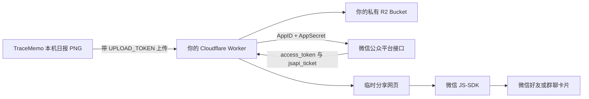

# 实验性功能：自托管微信分享卡片


> **实验性功能**  
> 该能力需要用户自行准备 Cloudflare、域名和微信公众平台测试号，目前不属于开箱即用的稳定功能。Cloudflare、微信 JS-SDK、测试号权限或微信客户端行为变化，都可能导致分享卡片失效。

## 新手推荐：直接交给 Agent

如果你不熟悉 Cloudflare、Wrangler 或命令行，不需要手动照着整篇文档操作。把下面这个 Skill 文件夹交给 Codex、Claude Code 或其他能够操作项目终端的编程 Agent：

```text
docs/skill/setup-wechat-share-card/
```

然后对 Agent 说：

```text
请使用 setup-wechat-share-card Skill，帮我部署 TraceMemo 的实验性微信分享卡片服务。尽量自动完成，只在缺少必要信息时一次性问我。
```

Agent 会自动：

- 检查 Node.js、pnpm 和 Wrangler；
- 必要时临时下载 Wrangler；
- 打开 Cloudflare 登录并执行 `whoami`；
- 自动生成 `UPLOAD_TOKEN`；
- 创建或复用私有 R2 Bucket；
- 写入 Worker Secret；
- 根据你的域名生成本机 Worker 配置；
- 部署 Worker并执行健康检查和微信签名检查；
- 把上传密钥复制到剪贴板，供你粘贴到 TraceMemo。

Agent 无法替你创建微信测试号或决定使用哪个域名，因此通常只需要你提供：

1. 你准备使用的分享域名，例如 `share.example.com`；
2. 微信测试号页面中的 AppID；
3. 微信测试号页面中的 AppSecret；
4. 浏览器弹出 Cloudflare OAuth 页面时完成一次登录授权。

真实配置保存在被 Git 忽略的本机 `.env` 中，不会写入 `.env.example`。不要把 `.env` 发给别人或提交到仓库。

TraceMemo 可以把已经生成的群聊日报长图发布为一个临时网页，并在微信中分享成带有标题、描述和缩略图的卡片。

TraceMemo **不提供公共卡片服务器**。使用该功能前，需要按照本文部署一套属于你自己的卡片服务。日报图片将上传到你自己的 Cloudflare R2，而不是上传到 TraceMemo 作者的服务器。

## 这个功能解决什么问题

直接把日报 PNG 发到微信，只会显示为一张普通图片。微信卡片还需要：

- 一个域名 (未能备案的话 在微信里点击多次 可能会被微信内置窗口提示需要备案)；
- 卡片标题和描述；
- 一张微信可以读取的缩略图；
- 微信 JS-SDK 签名；
- 一个临时保存日报图片的位置。

本项目提供的 Cloudflare Worker 负责这些工作。桌面端上传日报后，会得到一个分享链接和二维码。用微信扫码打开链接，再点击右上角菜单分享，即可生成微信卡片。

## 数据会经过哪里



与 TraceMemo 的本地浏览能力不同，启用分享卡片后，当前日报长图、缩略图、卡片标题和描述会离开本机，上传到你控制的 Cloudflare 账号。

## 你需要准备什么

| 项目                     | 用途                                         | 从哪里获得                               |
| ------------------------ | -------------------------------------------- | ---------------------------------------- |
| Cloudflare 账号          | 运行 Worker 和保存 R2 图片                   | 自行注册 Cloudflare                      |
| 托管在 Cloudflare 的域名 | 提供 HTTPS 分享地址                          | 使用自己的域名，例如 `share.example.com` |
| R2 Bucket                | 临时保存日报和缩略图                         | 使用 Wrangler 创建                       |
| `UPLOAD_TOKEN`           | 阻止陌生人调用你的上传接口                   | **由你自己随机生成**                     |
| 微信测试号 AppID         | 标识调用 JS-SDK 的微信应用                   | 微信公众平台接口测试号页面               |
| 微信测试号 AppSecret     | Worker 获取微信接口凭据                      | 微信公众平台接口测试号页面               |
| JS 接口安全域名          | 告诉微信哪些网页可以使用该 AppID 调用 JS-SDK | 在微信测试号页面填写你的分享域名         |

微信公众平台接口测试号入口：

<https://mp.weixin.qq.com/debug/cgi-bin/sandboxinfo?action=showinfo&t=sandbox/index>

微信 JS-SDK 官方文档：

<https://developers.weixin.qq.com/doc/offiaccount/OA_Web_Apps/JS-SDK.html>

## 理解三个重要配置

### `UPLOAD_TOKEN` 从哪里来

`UPLOAD_TOKEN` **不是从 Cloudflare 或微信后台领取的**，它是卡片服务部署者自己生成的一段随机密码。

它用于保护 Worker 的上传接口：TraceMemo 上传日报时，会发送：

```http
Authorization: Bearer <UPLOAD_TOKEN>
```

Worker 只有在密钥完全一致时才接受上传。没有它，任何知道接口地址的人都可能向你的 R2 上传文件并消耗资源。

在 macOS 或 Linux 中生成一枚 64 位十六进制随机密钥：

```bash
openssl rand -hex 32
```

示例输出只用于说明格式，不要直接使用：

```text
8a4d...一共 64 个十六进制字符...72ef
```

生成后，同一个值需要配置到两个地方：

1. Cloudflare Worker Secret `UPLOAD_TOKEN`；
2. TraceMemo“生成微信卡片”弹窗中的“上传密钥”。

如果两边不一致，卡片服务会返回 HTTP 401 或“未授权”。

TraceMemo 会使用 Electron `safeStorage` 将服务地址和上传密钥加密保存在本机。不要把密钥提交到 Git，也不要写入 `wrangler.jsonc`。

### AppID 和 AppSecret 从哪里来

打开[微信公众平台接口测试号](https://mp.weixin.qq.com/debug/cgi-bin/sandboxinfo?action=showinfo&t=sandbox/index)，使用微信扫码登录。

页面上方会显示：

- `appID`；
- `appsecret`。

将它们分别保存为 Worker Secret：

```text
WECHAT_APP_ID
WECHAT_APP_SECRET
```

它们的作用不同：

- AppID 用于标识这个微信测试应用；
- AppSecret 是高敏感凭据，Worker 用它向微信服务器获取 `access_token`；
- Worker 再使用 `access_token` 获取 `jsapi_ticket`；
- 最后使用 `jsapi_ticket`、当前网页 URL、时间戳和随机串生成 JS-SDK 签名。

AppSecret 只能保存在 Worker Secret 中。不要把它填写到 TraceMemo 的“上传密钥”输入框，不要发送给前端，也不要提交到仓库。怀疑泄露时，应立即在微信后台重置并更新 Worker Secret。

### JS 接口安全域名是干什么的

JS 接口安全域名是微信对网页来源的白名单。

假设你的分享服务地址是：

```text
https://share.example.com
```

那么测试号页面中的“JS 接口安全域名”应填写：

```text
share.example.com
```

填写时：

- 不带 `https://`；
- 不带 `/s/xxx` 等路径；
- 不要填写 Cloudflare Worker 名称；
- 必须与用户实际打开分享页时的域名一致。

它不是用来解析 DNS 的。域名仍然需要先在 Cloudflare 中正确绑定到 Worker。安全域名的作用是告诉微信：允许这个域名下的网页使用当前 AppID 请求 JS-SDK 能力。

如果没有配置、填错域名，或签名 URL 与实际页面 URL 不一致，通常会出现 `invalid signature`、`config:fail` 或分享信息没有生效。

微信可能要求下载一个 TXT 验证文件，并确保它可以通过下面的地址访问：

```text
https://share.example.com/微信提供的文件名.txt
```

项目 Worker 已包含根路径验证文件的实现方式。你需要把自己的文件名和内容加入 `services/share-card-worker/src/index.js` 中的 `WECHAT_DOMAIN_VERIFICATION`，然后重新部署。

## 自托管部署步骤

以下命令均在项目根目录执行。

### 1. 登录 Cloudflare

项目建议使用本地 Wrangler：

```bash
pnpm exec wrangler login
pnpm exec wrangler whoami
```

如果本地版本的 OAuth 登录出现 `invalid_scope` 等问题，可临时使用更新版本：

```bash
pnpm dlx wrangler@latest login
pnpm dlx wrangler@latest whoami
```

登录注意事项：

- 让 Wrangler 自动打开浏览器最稳妥；
- 不要复用以前生成的 OAuth 链接；
- 不要修改链接中的 `state`、`code_challenge` 或回调地址；
- 不建议使用无痕窗口或跨浏览器复制链接；
- 默认回调使用 `localhost:8976`，端口被占用时先结束旧的 Wrangler 登录进程；
- 浏览器提示授权成功后，仍应通过 `whoami` 核对账号。

### 2. 修改 Worker 配置

打开：

```text
services/share-card-worker/wrangler.jsonc
```

至少修改下面两个位置：

```jsonc
{
  "routes": [
    {
      "pattern": "share.example.com",
      "custom_domain": true
    }
  ],
  "vars": {
    "PUBLIC_ORIGIN": "https://share.example.com",
    "DEFAULT_EXPIRY_DAYS": "7"
  }
}
```

`routes[].pattern` 是 Worker 自定义域名，`PUBLIC_ORIGIN` 是生成分享链接和校验签名来源时使用的完整 HTTPS 地址，两者必须一致。

不要直接照抄仓库维护者的域名。请替换为你自己 Cloudflare 账号中的域名或子域名。

### 3. 创建私有 R2 Bucket

默认配置使用 Bucket 名称：

```text
wechatexplorer-share-reports
```

创建：

```bash
pnpm exec wrangler r2 bucket create wechatexplorer-share-reports \
  --config services/share-card-worker/wrangler.jsonc
```

Worker 中的绑定名称是 `REPORTS`。R2 会保存：

```text
cards/<card-id>/card.json
cards/<card-id>/report.png
cards/<card-id>/thumbnail.jpg
```

- `card.json`：标题、描述、创建时间和过期时间；
- `report.png`：完整日报长图；
- `thumbnail.jpg`：微信卡片缩略图。

请保持 R2 Bucket 私有，不要启用公开 `r2.dev` 开发 URL。图片应统一通过 Worker 的随机卡片 URL 读取。

### 4. 生成并配置 `UPLOAD_TOKEN`

```bash
openssl rand -hex 32
```

复制生成结果，然后执行：

```bash
pnpm exec wrangler secret put UPLOAD_TOKEN \
  --config services/share-card-worker/wrangler.jsonc
```

Wrangler 提示输入时粘贴密钥。终端不会正常显示 Secret 内容。

### 5. 配置微信 AppID 和 AppSecret

从[微信公众平台接口测试号](https://mp.weixin.qq.com/debug/cgi-bin/sandboxinfo?action=showinfo&t=sandbox/index)复制 AppID：

```bash
pnpm exec wrangler secret put WECHAT_APP_ID \
  --config services/share-card-worker/wrangler.jsonc
```

再复制 AppSecret：

```bash
pnpm exec wrangler secret put WECHAT_APP_SECRET \
  --config services/share-card-worker/wrangler.jsonc
```

Secret 不会出现在 `wrangler.jsonc` 中。如果你更换 Cloudflare 账号或重新创建 Worker，需要重新配置全部三个 Secret。

### 6. 配置微信测试号

在测试号页面完成：

1. 使用测试微信关注该测试号；
2. 将 `share.example.com` 填入“JS 接口安全域名”；
3. 按页面提示完成 TXT 文件域名验证；
4. 确认 AppID/AppSecret 与刚才写入 Worker 的值来自同一个测试号。

测试号只适合开发和验证。正式公众号的接口权限、认证要求和后台菜单可能不同，请以微信公众平台实际规则为准。

### 7. 部署 Worker

```bash
pnpm exec wrangler deploy \
  --config services/share-card-worker/wrangler.jsonc
```

Cloudflare Custom Domain 要求域名已经位于同一 Cloudflare 账号中。如果该子域名已经存在 A、AAAA 或 CNAME 记录，绑定可能失败。删除冲突记录，或者换一个未使用的子域名，例如 `share2.example.com`。

更新 Secret 后，如果线上仍提示旧配置，可再执行一次完整部署。

## 在 TraceMemo 中配置

生成一份日报后，点击“生成微信卡片（实验性）”。首次使用需要填写：

```text
服务地址：https://share.example.com
上传密钥：你自己通过 openssl rand -hex 32 生成的 UPLOAD_TOKEN
```

这里的“上传密钥”绝对不是微信 AppSecret。

配置保存后，TraceMemo 会上传当前日报和缩略图，返回二维码。使用已经关注测试号的微信扫码，打开页面后再通过右上角菜单分享。

## 验证部署

### 健康检查

```bash
curl -fsS https://share.example.com/health
```

正常结果类似：

```json
{ "ok": true, "service": "wechatexplorer-share-card", "storage": "ready" }
```

### JS-SDK 签名检查

```bash
curl -fsS \
  'https://share.example.com/api/wx-signature?url=https%3A%2F%2Fshare.example.com%2Fhealth'
```

正常结果应包含：

```text
appId
timestamp
nonceStr
signature
```

响应中不应包含 AppSecret、`access_token` 或 `jsapi_ticket`。

## 常见问题

### HTTP 401 / 未授权

TraceMemo 中保存的上传密钥与 Worker 的 `UPLOAD_TOKEN` 不一致。重新生成或重新配置时，必须同步更新两边。

### “微信 JS-SDK 尚未配置”

Worker 缺少 `WECHAT_APP_ID` 或 `WECHAT_APP_SECRET`。执行两个 `secret put`，再重新部署。

### `invalid signature` 或分享信息不生效

依次检查：

- `PUBLIC_ORIGIN` 是否与浏览器实际访问的 origin 完全一致；
- JS 接口安全域名是否只填写了域名；
- AppID/AppSecret 是否属于同一个测试号；
- AppSecret 是否已被重置但 Worker 仍保存旧值；
- 分享页面是否经过了改变 URL 的代理或重定向；
- 测试微信是否已关注测试号。

### 自定义域名绑定失败

检查同名 A、AAAA、CNAME 记录是否已经存在，域名是否位于当前 Wrangler 登录的 Cloudflare 账号中。

### R2 未配置

确认 Bucket 存在，并且 `wrangler.jsonc` 中的绑定名称为 `REPORTS`、`bucket_name` 与实际 Bucket 一致。

### 卡片过期或图片消失

默认有效期为 7 天。Worker 的定时任务会删除过期卡片的元数据、日报和缩略图，这是设计行为。

## 安全和隐私注意事项

- 日报可能包含敏感群聊内容。只分享你有权分享的内容。
- 获得分享 URL 的人，在过期前可能查看对应日报；当前实现不是按访问者身份授权。
- `UPLOAD_TOKEN` 是整个 Worker 的服务级密钥，不是每个用户独立的账号凭据。
- 不要把 `UPLOAD_TOKEN`、AppSecret 或 Wrangler 凭据提交到 Git。
- R2 保持私有，不要把 Bucket 直接公开。
- 建议定期轮换 `UPLOAD_TOKEN`，怀疑泄露时立即轮换。
- 微信 AppSecret 泄露时，应在微信后台重置，并立即更新 Worker Secret。
- 自托管者自行承担 Cloudflare 用量、域名、数据合规和微信平台规则相关责任。

## 当前实验性限制

- 需要用户自己部署，普通用户无法直接开箱使用；
- 使用一个共享的 `UPLOAD_TOKEN`，没有多用户账号系统；
- 分享链接在有效期内属于“知道链接即可访问”；
- 依赖微信 JS-SDK 和测试号能力，微信侧规则变化可能造成失效；
- 当前仅上传 PNG 日报和 JPEG 缩略图；
- 没有管理后台用于列出、提前删除或审计所有卡片；
- 过期清理由定时任务完成，不保证到期瞬间立即删除。

## 代码入口

- Worker：`services/share-card-worker/src/index.js`
- Worker 配置：`services/share-card-worker/wrangler.jsonc`
- Worker 测试：`services/share-card-worker/test/index.test.js`
- 桌面端上传：`src/main/wechat-share-card-service.ts`
- 本地加密配置：`src/main/wechat-share-config-store.ts`
- 分享弹窗：`src/renderer/src/components/reports/WechatShareCardDialog.tsx`
- 共享类型：`src/shared/wechat-share-card.ts`

## 参考资料

- [微信公众平台接口测试号](https://mp.weixin.qq.com/debug/cgi-bin/sandboxinfo?action=showinfo&t=sandbox/index)
- [微信 JS-SDK 官方文档](https://developers.weixin.qq.com/doc/offiaccount/OA_Web_Apps/JS-SDK.html)
- [Cloudflare Wrangler 命令文档](https://developers.cloudflare.com/workers/wrangler/commands/)
- [Cloudflare R2 Wrangler 命令](https://developers.cloudflare.com/workers/wrangler/commands/r2/)
- [在 Worker 中绑定和使用 R2](https://developers.cloudflare.com/r2/api/workers/workers-api-usage/)
- [Cloudflare Worker Custom Domains](https://developers.cloudflare.com/workers/configuration/routing/custom-domains/)
